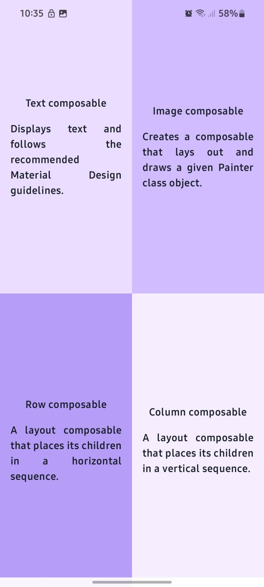

# GridLayout
A Jetpack Compose app that displays information about key Composable functions in a 4-quadrant layout. Each quadrant showcases a function name and a short description using layout modifiers and styled text.

---

## 📱 App Features:
- 🧱 2x2 quadrant layout
- ℹ️ Each quadrant contains:
    - A Composable function name
    - A short description
- 🎨 Styled using colors, padding, alignment

---

## 📸 Preview:  
    
